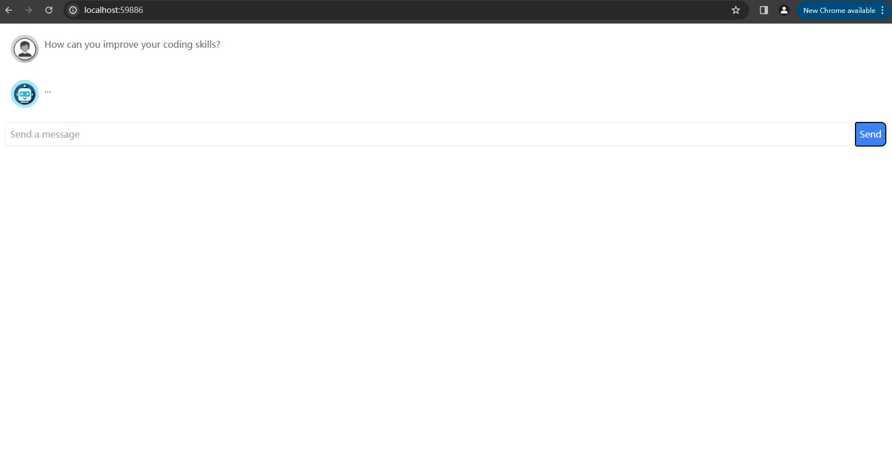
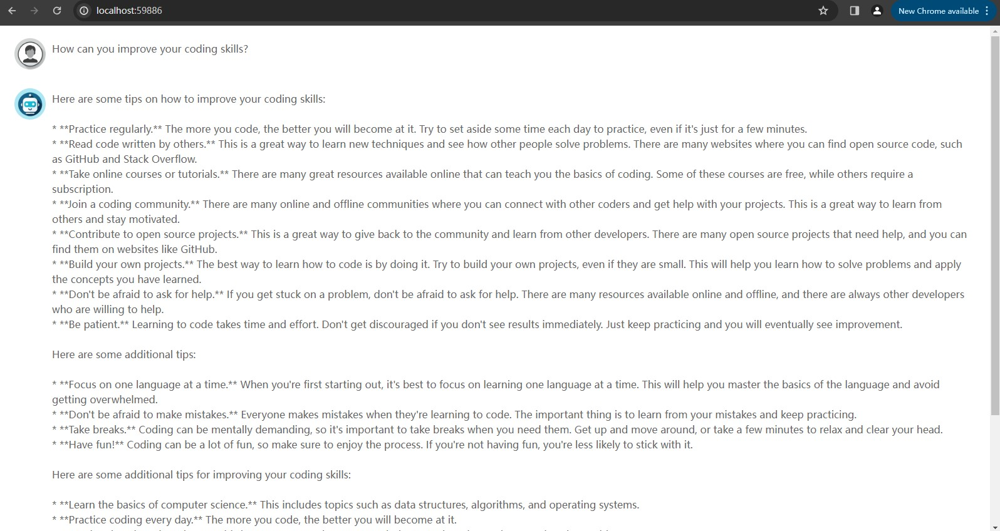

# Chatbot Project Overview
This project features a chatbot built using Angular 17 and NodeJS, integrating the `models/chat-bison-001` for natural language processing.

## Getting Started
To use this chatbot, obtain your own API key from the [Generative Language API](https://console.cloud.google.com/apis/library/browse?q=generative%20language%20api). The server requires this API key, set in an environment variable named `API_KEY`.

### Todo
- Upgrade to using Websocket
- Tailwind Styling

### Current Project Status (Work In Progress)
- 
- 

## Software Requirements
- **NodeJS**: Version 18.19.0
- **Angular CLI**: Version 17.0.7

## Setting Up the Server
Follow these steps to install server dependencies and run the server:

```bash
# Navigate to the server directory
cd server

# Install dependencies
yarn

# Return to the project root
cd ..

# Run the server
node server
```

## Setting Up the Frontend
Follow these steps to install server dependencies and run the server:

```bash
# Navigate to the frontend directory
cd frontend

# Install dependencies
yarn

# Start the frontend development server
yarn start
```
